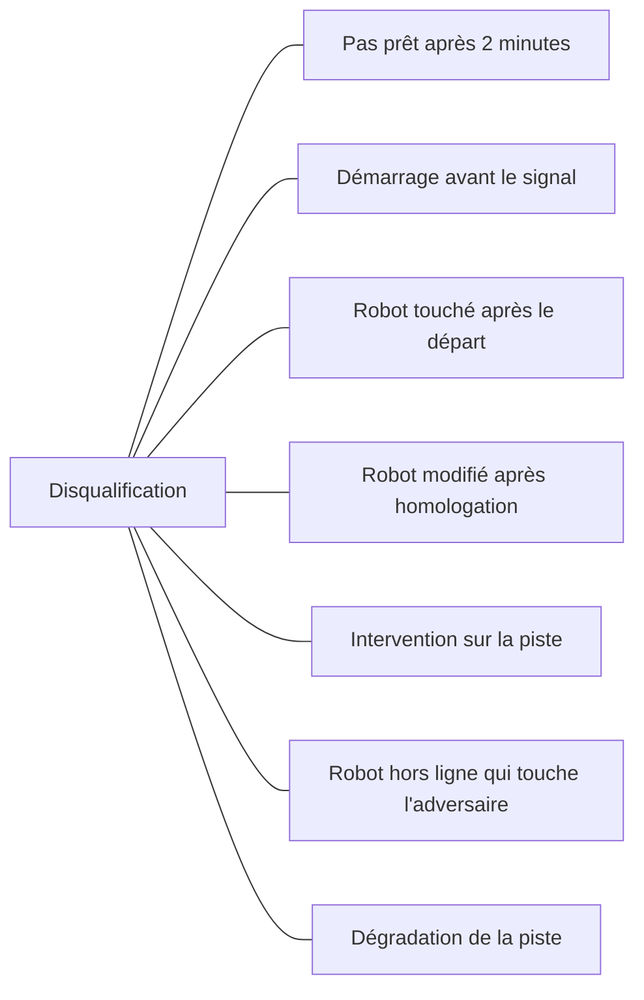
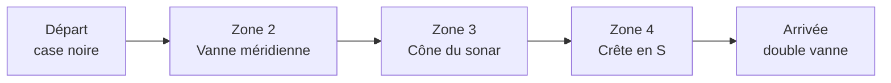
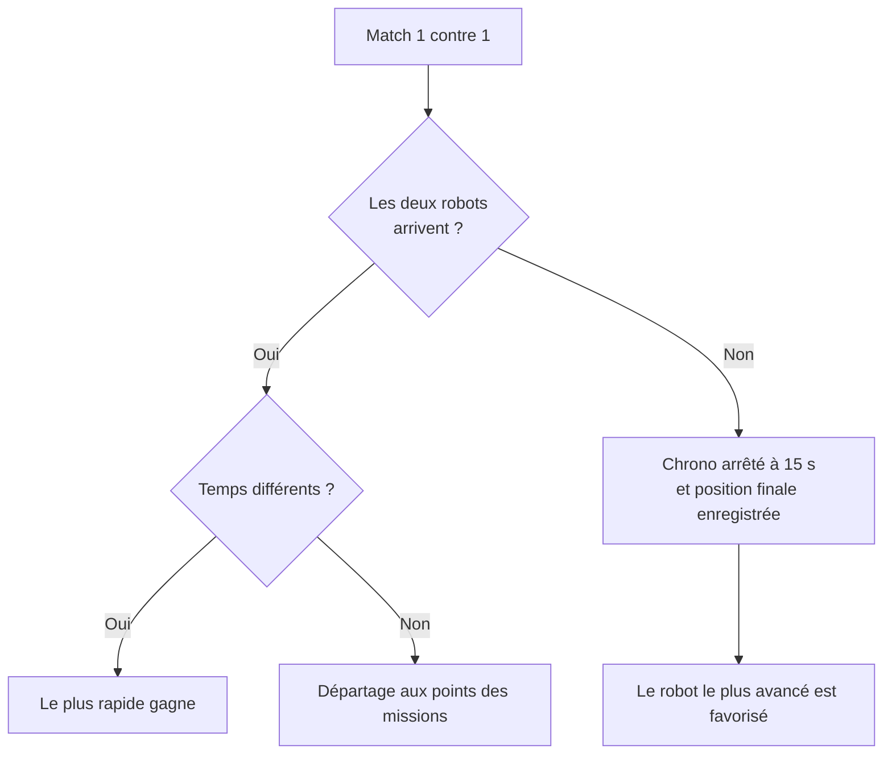
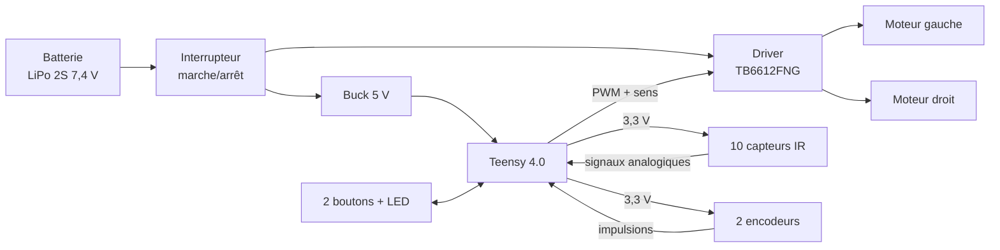
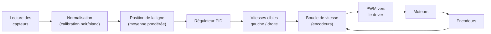
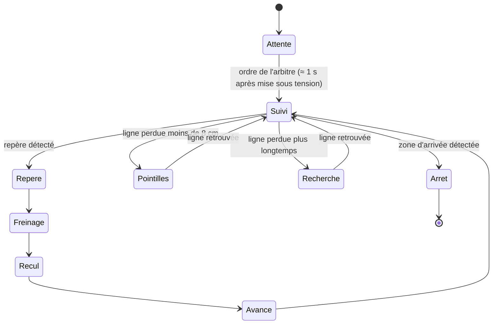
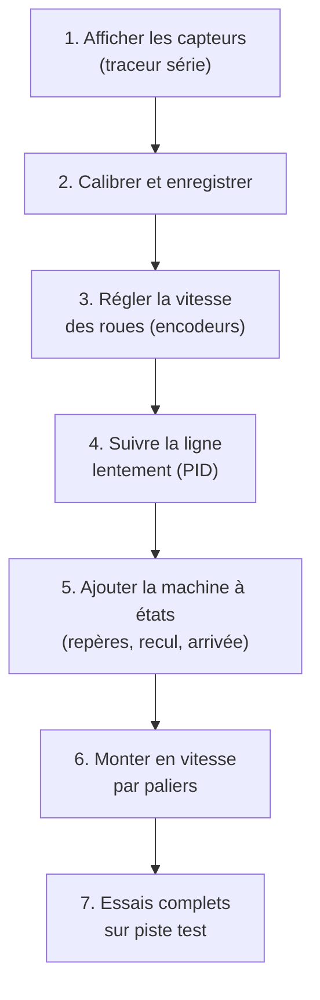
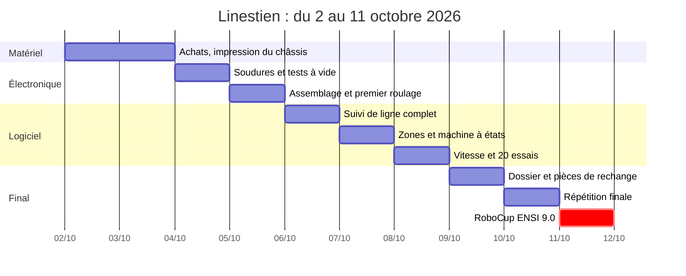

# 🤖 Linestien : robot suiveur de ligne pour RoboCup ENSI 9.0

> Compétition **« Suiveur de ligne : Last Reserve »** (robot PIPE-GUARD-S7), thème **ECOVERSE**
> 📅 **11 octobre 2026**, École Nationale des Sciences de l'Informatique (ENSI), Manouba
> 🎯 **Objectif : gagner chaque match 1 contre 1 en étant le plus rapide, sans jamais sortir de la ligne.**

Ce document explique le cahier des charges officiel, puis comment nous concevons, construisons et programmons Linestien. Il est écrit pour que chaque membre de l'équipe comprenne tout le projet.

---

## 📑 Sommaire

1. [Résumé en 30 secondes](#1-résumé-en-30-secondes)
2. [La compétition](#2-la-compétition)
3. [Règles à respecter](#3-règles-à-respecter)
4. [Le parcours et les missions](#4-le-parcours-et-les-missions)
5. [Comment on gagne un match](#5-comment-on-gagne-un-match)
6. [Cahier des charges de Linestien](#6-cahier-des-charges-de-linestien)
7. [Matériel et masse](#7-matériel-et-masse)
8. [Choix des moteurs](#8-choix-des-moteurs)
9. [Électronique](#9-électronique)
10. [Logiciel](#10-logiciel)
11. [Fabrication étape par étape](#11-fabrication-étape-par-étape)
12. [Stratégie de course](#12-stratégie-de-course)
13. [Tests et checklist d'homologation](#13-tests-et-checklist-dhomologation)
14. [Planning](#14-planning)
15. [Questions à poser aux organisateurs](#15-questions-à-poser-aux-organisateurs)
16. [Glossaire](#16-glossaire)
17. [Contacts et organisation du dépôt](#17-contacts-et-organisation-du-dépôt)

---

## 1. Résumé en 30 secondes

| Question | Réponse |
|---|---|
| Que fait le robot ? | Il suit une ligne noire sur un plateau blanc, passe 4 zones et s'arrête entre les deux cercles de l'arrivée. |
| Comment est-il classé ? | **D'abord au temps.** Les points ne servent qu'en cas d'égalité de temps. |
| Taille maximale | 20 × 20 × 20 cm, **sans aucune tolérance**. |
| Notre robot | ≈ 13,5 × 11,5 × 4 cm, ≈ 150 g, 2 moteurs N20 à encodeurs, Teensy 4.0, 8 capteurs infrarouges. |
| Vitesse visée | 1,2 à 1,5 m/s en moyenne, pointes à 2 m/s. |
| Piège principal | Sortir de la ligne, toucher l'adversaire ou démarrer avant le signal. |

---

## 2. La compétition

- **9e édition** de RoboCup ENSI, organisée par l'Association Robotique ENSI.
- 4 épreuves : Suiveur de ligne, Autonome, Junior, Tout Terrain. **Nous participons au suiveur de ligne.**
- **Équipe :** 3 membres maximum (un chef d'équipe et 2 coéquipiers). Frais : 60 DT par équipe.
- Le chef d'équipe gère l'inscription et **doit être présent le jour J** (sinon l'homologation n'est pas validée).
- Le format est le **1 contre 1** : deux robots sur deux pistes identiques, le gagnant passe au tour suivant. Si le nombre d'équipes n'est pas une puissance de deux, des matchs supplémentaires sont organisés.

### L'histoire (le thème)

Après une explosion, le **Réseau Abyssal** (un réseau de canalisations sous-marin) fuit en plusieurs endroits. Le robot **PIPE-GUARD-S7** doit suivre le tracé, s'arrêter aux points de fuite, reculer puis avancer (il « resserre une vanne »), et finir sur la **double vanne**.

---

## 3. Règles à respecter

### 3.1 Règles du robot

| Règle | Détail |
|---|---|
| Dimensions | **20 cm × 20 cm × 20 cm maximum, aucune marge de tolérance** |
| Autonomie | Totalement autonome : ni télécommande, ni câble |
| Fabrication | Au moins en partie réalisée par l'équipe |
| Kits | Les kits NXT sont interdits |
| Interrupteur | **Interrupteur marche/arrêt obligatoire** |
| Énergie | Énergie stockée uniquement, pas de combustion ni de pyrotechnie |
| Sécurité | Aucune arête coupante, aucune pointe, aucun liquide, aucun produit corrosif |
| Homologation | 1 seul robot, 2 tentatives maximum, **aucune modification après homologation** |
| Dossier technique | Dossier mécanique et électrique obligatoire (un dossier incomplet entraîne un refus) |

### 3.2 Règles du match

- Le robot est mis sous tension **uniquement sur ordre de l'arbitre**.
- 2 minutes pour poser le robot au départ, sinon disqualification.
- Aucune manipulation du robot ni de la piste pendant le match.
- **Hors ligne** = vu de dessus, aucune partie du robot ne touche la ligne.
- **Bloqué** = le robot reste immobile, sans aucun mouvement détectable.
- Franchir la ligne d'arrivée met fin au match.

### 3.3 Causes de disqualification



---

## 4. Le parcours et les missions

Le plateau fait **560 × 210 cm**. Le tracé est en vinyle noir sur fond blanc. Les organisateurs annoncent une tolérance de fabrication de 10 % et aucune réclamation sur les écarts de dimension.



| Zone | Description | Choix possibles | Points |
|---|---|---|---|
| Départ | Case noire, le robot démarre sur ordre de l'arbitre | : | 0 |
| **Zone 2** : vanne méridienne | Un cercle avec 3 trajets | Chemin direct (ligne droite) | 10 |
| | | Chemin en arc (portion du contour) | 10 |
| | | **Chemin complet ¾ de tour** | **20** |
| **Zone 3** : cône du sonar | Un entonnoir avec une ligne centrale en pointillés | Courbe supérieure | 20 |
| | | Courbe inférieure | 20 |
| | | Ligne centrale en pointillés (signal) | 10 |
| **Zone 4** : crête | Courbe en S entre deux repères, à suivre sans quitter la ligne | : | 0 |
| **Points de fuite** | S'arrêter exactement, **reculer, puis avancer** | : | : |
| **Arrivée** | S'immobiliser entre les deux cercles | : | : |

Maximum théorique : **40 points** (¾ de tour en zone 2 + courbe supérieure ou inférieure en zone 3).

> ⚠️ Le texte du cahier des charges parle de repères en **losanges**, mais le plan montre des symboles de vannes (barres transversales). Voir [section 15](#15-questions-à-poser-aux-organisateurs).

---

## 5. Comment on gagne un match

**Le classement se fait en priorité sur la vitesse.** Les points ne comptent qu'en cas d'égalité de temps.



### Collisions

| Situation | Résultat |
|---|---|
| Contact accidentel entre les deux robots | Victoire automatique de l'adversaire |
| Robot hors ligne qui entre en collision avec l'adversaire | Disqualification immédiate |
| Collision simultanée sans sortie de ligne | Chaque robot a un second essai individuel |
| Collision simultanée avec sortie de ligne des deux | Victoire à celui qui a parcouru la plus grande distance |

Lorsqu'un second essai est accordé, **seul son résultat compte**.

### Conclusion stratégique

1. **Fiabilité d'abord** : un robot qui sort de la ligne perd presque toujours.
2. **Vitesse ensuite** : c'est elle qui décide du classement.
3. **Les points en dernier** : ils ne servent qu'à départager une égalité.

---

## 6. Cahier des charges de Linestien

| Critère | Objectif |
|---|---|
| Dimensions | ≈ 13,5 × 11,5 × 4 cm (limite : 20 × 20 × 20 cm) |
| Masse | ≈ 150 g (fourchette 130 à 180 g), 60 à 70 % du poids sur l'essieu moteur |
| Vitesse moyenne | 1,2 à 1,5 m/s, pointes à 2 m/s en ligne droite |
| Accélération / freinage | 3 à 5 m/s² |
| Précision d'arrêt | ± 5 mm sur chaque repère et à l'arrivée |
| Fiabilité | 0 sortie de ligne sur 20 essais consécutifs avant le jour J |
| Autonomie | ≥ 10 minutes de roulage |
| Démarrage | Automatique environ 1 s après la mise sous tension |

### Vue de dessus (schéma simplifié)

```
                    ↑ AVANT
        ◉      ● ● ● ● ● ● ● ●      ◉      ← 8 capteurs + 2 latéraux
       ┌────────[ barrette IR ]────────┐
       │                               │
       │    [5V]   [Teensy]   [TB6612] │
       │                               │
  ▐█▌══╪═[Moteur G]═ axe ═[Moteur D]═══╪══▐█▌   ← roues Ø 32 mm
       │                               │
       │      (○)(○)(•)   [LiPo 2S]    │   [ON/OFF]
       │                               │
       └──────────────○────────────────┘
                   bille
```

Cotes principales : barrette à **6,5 cm devant l'axe** des roues, bille à **6 cm derrière**, écartement des roues ≈ **10,5 cm**, capteurs à **3 mm du sol**. Le centre de gravité est environ 2 cm derrière l'axe : cela met environ 65 % du poids sur les roues motrices (bonne adhérence) et 35 % sur la bille.

---

## 7. Matériel et masse

| Élément | Choix recommandé | Masse |
|---|---|---|
| Châssis | Plaque PETG imprimée 3D (2 mm) ou PCB 1,6 mm | ≈ 40 g |
| 2 moteurs | Micro-moteurs **N20 12 V** à encodeurs magnétiques | ≈ 22 g |
| 2 roues | Ø 30 à 32 mm, pneus silicone | ≈ 10 g |
| Appui arrière | Bille de glissement ou patin PTFE | ≈ 4 g |
| Capteurs | Barrette de **8 capteurs IR** (QRE1113 ou TCRT5000) au pas de 9 mm, plus **2 capteurs latéraux** | ≈ 12 g |
| Microcontrôleur | **Teensy 4.0** (alternatives : STM32 Black Pill, ESP32, Arduino Nano) | ≈ 3 g |
| Driver moteurs | **TB6612FNG** (1,2 A continu, 3 A en pointe) | ≈ 2 g |
| Batterie | **LiPo 2S 7,4 V**, 300 à 450 mAh, 30C minimum | ≈ 25 g |
| Alimentation logique | Convertisseur buck 5 V | ≈ 3 g |
| Interrupteur et câbles | Interrupteur marche/arrêt accessible | ≈ 8 g |
| Visserie | M2 / M2,5 nylon ou laiton | ≈ 10 g |
| Interface | 2 boutons + 1 LED | ≈ 5 g |
| **Total estimé** | | **≈ 144 g** |

Les masses sont indicatives : pesez chaque pièce achetée et mettez ce tableau à jour.

**Outils :** fer à souder, multimètre, pied à coulisse, balance au gramme, ruban adhésif noir, imprimante 3D (ou découpe de carte perforée).

---

## 8. Choix des moteurs

On part de la vitesse voulue, pas du catalogue.

1. **Vitesse de roue :** pour 1,5 m/s avec une roue de 32 mm (circonférence ≈ 0,1 m), il faut environ **900 tr/min en charge**.
2. **Vitesse à vide :** prévoir 1,5 à 2 fois cette valeur, soit **1 400 à 1 800 tr/min à 7,4 V**.
3. **Rapport de réduction :** un N20 12 V avec réduction **10:1 à 15:1** convient (environ 1 800 tr/min à 7,4 V pour un 10:1).

   | Rapport | Effet |
   |---|---|
   | 5:1 | Très rapide, mais peu de couple pour freiner précisément |
   | **10:1 à 15:1** | **Meilleur compromis** |
   | 30:1 | Trop lent pour nos objectifs |

4. **Couple :** pour 150 g accélérés à 4 m/s², la force est de 0,6 N, soit environ **0,05 kg·cm par roue**. Un N20 de qualité en donne largement plus.
5. **Vraie limite :** l'**adhérence**, pas le moteur. Avec 65 % du poids sur les roues et un frottement de l'ordre de 1, l'accélération maximale est d'environ 6 m/s².
6. **Encodeurs magnétiques :** indispensables pour s'arrêter à ± 5 mm, reculer d'une distance exacte et réguler la vitesse.

> Ce sont des ordres de grandeur. Vérifiez la fiche technique du vendeur (vitesse à vide, tension nominale, rapport exact) avant d'acheter, et prenez 4 moteurs identiques pour avoir une paire de secours.

---

## 9. Électronique

### 9.1 Schéma-bloc



### 9.2 Câblage proposé (à vérifier sur le schéma de brochage du Teensy)

| Fonction | Broches Teensy 4.0 |
|---|---|
| Capteurs barrette S1 à S8 | A0 à A7 (broches 14 à 21) |
| Capteurs latéraux gauche, droite | A8, A9 (broches 22, 23) |
| Moteur gauche (PWMA, AIN1, AIN2) | 2, 3, 4 |
| Moteur droit (PWMB, BIN1, BIN2) et STBY | 5, 6, 7 et 8 |
| Encodeur gauche (A, B) / droit (A, B) | 0, 1 / 9, 10 |
| Boutons / LED | 11, 12 (INPUT_PULLUP) / 13 (LED intégrée) |

### 9.3 Carte capteurs

Chaque capteur QRE1113 / TCRT5000 :

- LED infrarouge → résistance **220 Ω** → 3,3 V
- Phototransistor → résistance de rappel **10 kΩ** → 3,3 V
- Sortie → entrée analogique

Les capteurs sont placés à **3 mm du sol** (2 à 4 mm, ajustable avec des rondelles). Si la salle est très éclairée, ajoutez un petit cache contre la lumière directe.

### 9.4 Précautions

- ⚠️ **Les broches du Teensy 4.0 ne supportent pas 5 V.** N'y reliez jamais une sortie 5 V.
- Ajoutez un condensateur de **100 µF** près du driver moteurs.
- **LiPo :** charge avec un chargeur équilibreur adapté, jamais sous 3,3 V par élément, stockage dans un sac ignifugé. Un bipeur d'alarme de tension est recommandé.
- L'interrupteur doit **couper toute l'alimentation** et rester accessible.

---

## 10. Logiciel

### 10.1 Chaîne de commande



### 10.2 Machine à états du match



### 10.3 Calcul de la position (extrait C++ / Teensyduino)

```cpp
float lirePosition() {              // -3,5 (gauche) … +3,5 (droite)
  float num = 0, den = 0;
  for (int i = 0; i < 8; i++) {
    float v = constrain((analogRead(14 + i) - mn[i]) / (float)(mx[i] - mn[i]), 0, 1); // 0 blanc … 1 noir
    num += v * (i - 3.5);
    den += v;
  }
  return den > 0.2 ? num / den : NAN;   // NAN = ligne perdue
}

// boucle à 1 kHz
float e = lirePosition();
float d = (e - ePrec) / dt;
float corr = Kp * e + Kd * d;            // sens à vérifier selon le câblage
moteurs(vBase - corr, vBase + corr);
```

### 10.4 Règles de comportement

| Situation | Comportement |
|---|---|
| Virage serré ou boucle | Ralentir selon l'erreur de position |
| Ligne droite | Accélérer jusqu'à la vitesse maximale |
| Pointillés (ligne perdue < 8 cm) | Continuer droit à la dernière consigne |
| Ligne perdue plus longtemps | Revenir vers le dernier côté vu en ralentissant |
| Repère de fuite | Freiner sur distance fixe, arrêt, recul court, avance, reprise du suivi |
| Arrivée | Arrêt par distance (encodeurs) |

### 10.5 Calibration

- Mesurer le min et le max de chaque capteur sur le **vinyle de la salle**, avant le match.
- Enregistrer en mémoire flash : **aucune manipulation n'est autorisée après l'ordre de l'arbitre**.
- Seuils adaptatifs pendant la course pour compenser la lumière.

### 10.6 Réglage du PID

1. Kd = 0 et Kp très faible.
2. Augmenter Kp jusqu'aux oscillations, puis revenir à environ 60 %.
3. Ajouter Kd jusqu'à ce que les oscillations disparaissent.
4. Monter la vitesse par paliers **0,4 → 0,8 → 1,2 → 1,5 m/s**, seulement après 5 passages propres de suite.
5. Régler chaque zone séparément (vitesse réduite avant le cône et la boucle, pleine vitesse en ligne droite).

---

## 11. Fabrication étape par étape

### Étape 1 : fixer la géométrie

Écartement des roues ≈ 10,5 cm, capteurs à 6,5 cm devant l'axe, bille à 6 cm derrière. Plus la barrette est loin devant l'axe, plus le robot est stable à haute vitesse ; plus elle est près, plus il est vif.

### Étape 2 : le châssis

Plaque PETG imprimée en 3D (2 mm, environ 10 × 13 cm) avec supports moteurs, ou carte perforée découpée. Trous M2 pour les étriers N20. **Arrondissez tous les angles.**

### Étape 3 : la carte capteurs

Soudez 8 capteurs au pas de 9 mm sur une petite carte (≈ 7,4 × 1 cm), et 2 capteurs latéraux à ± 4,5 cm de l'axe. Fixez la carte à 3 mm du sol.

### Étape 4 : l'électronique

Batterie → interrupteur → driver (7,4 V) et buck 5 V → Teensy (VIN). Le 3,3 V du Teensy alimente capteurs et encodeurs.

### Étape 5 : assemblage et tests à vide

1. Sans les moteurs : vérifier 5 V et 3,3 V au multimètre.
2. Monter les moteurs et les roues, tester chaque sens (inverser les fils si besoin).
3. Vérifier que chaque encodeur compte positivement quand la roue avance.
4. Peser, mesurer à la règle, vérifier que l'interrupteur coupe tout.

### Étape 6 : programmer par paliers



### Plan B si le matériel n'arrive pas à temps

Prenez ce qui existe localement : Arduino Nano ou ESP32 à la place du Teensy (8 entrées analogiques suffisent), modules TCRT5000, N20 12 V avec encodeurs, driver TB6612 ou DRV8833. Le principe est identique ; la vitesse maximale sera un peu plus faible.

---

## 12. Stratégie de course

| Mode | Zone 2 | Zone 3 | Quand l'utiliser |
|---|---|---|---|
| **Vitesse (par défaut)** | Direct (10 pts) | Pointillés (10 pts) | Chemin le plus court, quand le robot est fiable |
| **Sûr** | Direct | Courbe extérieure (20 pts) | Si les pointillés posent problème |
| **Points** | ¾ de tour (20 pts) | Courbe extérieure (20 pts) | Seulement si le détour coûte moins d'environ 0,3 s |

Le mode se choisit avec les 2 boutons **avant** le match, jamais après la mise sous tension. Les points ne comptent qu'en cas d'égalité de temps : le mode vitesse est donc le choix naturel.

---

## 13. Tests et checklist d'homologation

### Tests

- Reproduire avec du ruban noir au moins la **zone 3** (cône avec pointillés) et une **vanne**.
- Mesurer le temps de chaque zone et noter chaque sortie de ligne.
- **Ne changer qu'un paramètre à la fois.**
- Objectif : 20 passages consécutifs sans sortie de ligne.

### Checklist avant l'homologation

- [ ] Mesure à la règle : **20 cm maximum** dans chaque direction
- [ ] Interrupteur marche/arrêt présent et accessible
- [ ] Aucune arête vive, aucune pointe
- [ ] Robot totalement autonome (pas de câble ni de télécommande)
- [ ] Démarrage uniquement sur ordre de l'arbitre
- [ ] Dossier technique mécanique et électrique prêt (schéma électrique, plan mécanique avec masse, liste du matériel, schéma-bloc du programme, justification moteurs et batterie)
- [ ] Batterie pleine
- [ ] Pièces de rechange : moteur, roue, batterie
- [ ] Chef d'équipe présent (ou remplaçant déclaré)

---

## 14. Planning



---

## 15. Questions à poser aux organisateurs

À envoyer à **suivrobocup9@gmail.com** :

1. Le texte parle de repères en **losanges**, mais le plan montre des **barres transversales** et des symboles de vannes. Lesquels déclenchent le « s'arrêter, reculer, avancer » ?
2. De quelle **distance** faut-il reculer, et la manœuvre est-elle chronométrée ?
3. Quelle est la **largeur exacte du trait** et la couleur de la case de départ ?
4. La zone 4 (crête) est-elle **plate ou en relief** ?
5. Une **batterie LiPo** est-elle acceptée ? (le règlement parle de sources d'énergie stockées sans procédé chimique) Sinon : quelle alternative ?
6. Un **ventilateur d'appui** est-il autorisé ? (non recommandé tant que ce n'est pas confirmé)
7. Quelle est la **précision du chronométrage** ?

---

## 16. Glossaire

| Terme | Signification |
|---|---|
| **Suiveur de ligne** | Robot qui suit automatiquement une ligne tracée au sol |
| **Capteur IR réfléchissant** | Émet de la lumière infrarouge et mesure ce qui revient : le blanc réfléchit, le noir absorbe |
| **PID** | Régulateur qui corrige l'erreur actuelle (P), son évolution (D) et son cumul (I) |
| **Encodeur** | Capteur qui compte les tours de roue : il mesure vitesse et distance |
| **PWM** | Signal qui règle la puissance d'un moteur en variant le temps d'allumage |
| **Driver moteur** | Circuit qui fournit le courant aux moteurs sur ordre du microcontrôleur |
| **LiPo 2S** | Batterie lithium-polymère de 2 éléments (7,4 V) |
| **Homologation** | Contrôle du robot par le jury avant la compétition |
| **Ligne perdue** | Aucun capteur ne voit la ligne |

---

## 17. Contacts et organisation du dépôt

### Organisation

- ✉️ E-mail maquette : suivrobocup9@gmail.com
- 📘 Facebook : [Association Robotique ENSI](https://www.facebook.com/association.robotique.ensi) · [RoboCup ENSI](https://www.facebook.com/RoboCup.ENSI)
- 🏫 École Nationale des Sciences de l'Informatique, Campus universitaire Manouba, Manouba 2010

### Structure suggérée du dépôt

```
linestien/
├── README.md              ← ce fichier
├── docs/
│   ├── cahier-des-charges.pdf
│   ├── dossier-technique.pdf
│   └── images/
├── hardware/
│   ├── chassis/           ← fichiers 3D (STL)
│   ├── schemas/           ← schéma électrique, PCB
│   └── nomenclature.csv
├── firmware/
│   ├── linestien.ino
│   └── calibration/
└── tests/
    └── journal-essais.md  ← temps, sorties de ligne, réglages PID
```

---

## ⚠️ Avertissement

Ce document est une **proposition de conception** rédigée à partir du cahier des charges officiel. Les masses, vitesses et références de composants sont des **ordres de grandeur** à vérifier avec les fiches techniques. En cas de contradiction, **le règlement officiel des organisateurs fait foi.**

*Équipe Linestien · RoboCup ENSI 9.0 · 11 octobre 2026*